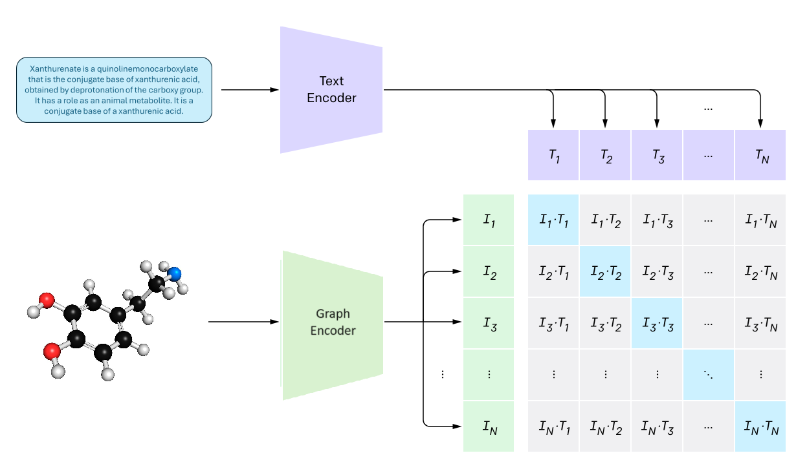

# ALTEGRAD Kaggle competition

The goal of this project is to study and apply machine learning/artificial intelligence techniques to retrieve molecules (graphs) using natural language queries. Natural language and molecules encode information in very different ways, which leads to the exciting but challenging problem of integrating these two very different modalities.

## About the challenge

In this challenge, given a text query and list of molecules (represented as graphs), without any reference or textual information of the molecule, we need to retrieve the molecule corresponding to the query. This requires the integration of two very different types of information: the structured knowledge represented by text and the chemical properties present in molecular graphs. 

## A few words about the method

The pipeline to deal with this task can be achieved by co-training a text encoder and a molecule encoder using contrastive learning. This involves simultaneously training two separate encoders—one specialized in handling textual data and the other focused on molecular structures. Through contrastive learning, the model learns to map similar text-molecule pairs closer together in the learned representation space while pushing dissimilar pairs apart.

A part of the text data and the molecule data was unmatched, so we tried to leverage it by using a pre-trained text encoder and a pre-trained molecule encoder.
For the text encoder, we pretrained a DistilBERT model and its tokenizer on the text data with masked language modeling. For the molecule encoder, we pretrained a Graph Attention Network with contrastive representation learning. More details are available in the [report](report.pdf).